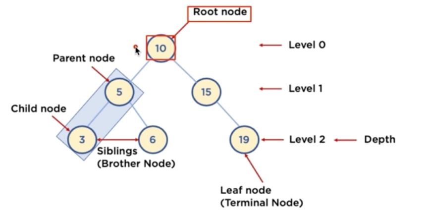
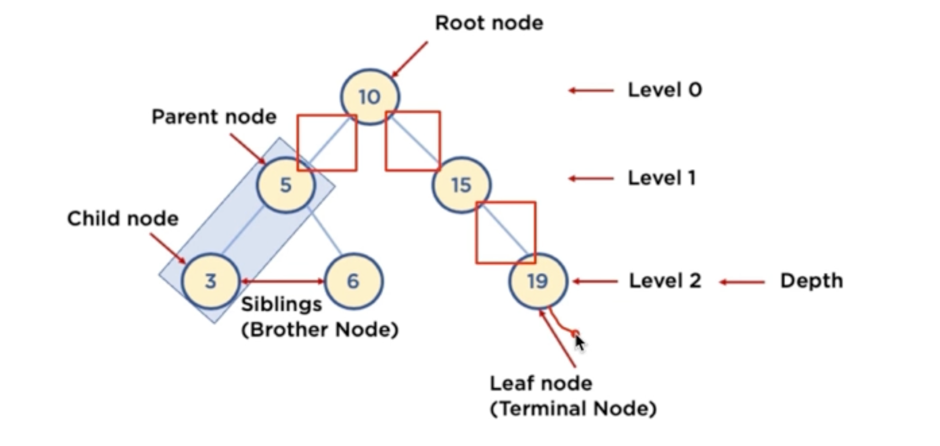

잔재미 강사님의 강의를 보고 개인적으로 공부하기 위한 md 정리 파일

linked List
- 하나의 저장될 데이터가 있을때마다 다음 데이터가 있을때 두 가지 저장 공간을 가지게 된다.
- 첫번째 노드가 다음 데이터 주소를 가지고 있고, 다음 데이터도 그다음 데이터의 주소를 가리키는것.
- 장점은 미리 데이터 공간을 할당하지 않아도 된다.
    - 배열은 미리 데이터 공간을 할당해야 한다.
- 단점은 다음 데이터 공간이 필요하므로 저장곤간 효율이 높지 않다.
- 연결 정보를 찾는 시간이 필요하므로 접근 속도가 느리다.
- 중간 데이터 삭제시, 앞뒤 데이터의 연결을 재구성해야 하는 부가적인 작업 이 필요하다.

---
알고리즘 복잡도 표현 방법
- 하나의 문제를 푸는 알고리즘은 다양할 수 있음
    - 정수의 절대값 구하기
        - 1, -1 ->> 1
        - 방법1: 정수값을 제곱한 값에 다시 루트를 씌우기
        - 방법2: 정수가 음수인지 확인해서, 음수일 때만, -1 을 곱하기


> 다양한 알고리즘 중 어느 알고리즘이 더 좋은지를 분석기 위해 , 복잡도를 정의하고 계산함.

- 복잡도는 보통 어떻게 정희하나욘 ?
    1. 시간 복잡도 : 알고리즘 실행 속도
    2. 공간 복잡도 : 알고리즘이 사용하는 메모리 사이즈

> 가장 중요한 시간 복잡도를 꼭 이해하고 계산할 수 있어야함.

- 입력의 크기가 커지면 커질수록 반복문이 알고리즘 수행 시간을 지배함.

### 3. 대문자 O 표기법
* 빅 오 표기법, Big-O 표기법 이라고도 부름
* O(입력)
    - 입력 n 에 따라 결정되는 시간 복잡도 함수
    - O(1), O($log n$), O(n), O(n$log n$), O($n^2$), O($2^n$), O(n!)등으로 표기함
    - 입력 n 의 크기에 따라 기하급수적으로 시간 복잡도가 늘어날 수 있음
        - O(1) < O($log n$) < O(n) < O(n$log n$) < O($n^2$) < O($2^n$) < O(n!)
            - 참고: log n 의 베이스는 2 - $log_2 n$
              <br><br>
* 단순하게 입력 n에 따라, 몇번 실행이 되는지를 계산하면 됩니다.
    - **표현식에 가장 큰 영향을 미치는 n 의 단위로 표기합니다.**
    - n이 1이든 100이든, 1000이든, 10000이든 실행을
        - 무조건 2회(상수회) 실행한다: O(1)
           ```java
                if (n > 10) {
                    System.out.println(n);
                }
                
           ```
        - n에 따라, n번, n + 10 번, 또는 3n + 10 번등 실행한다: O(n)
            - 다음 코드는 이중 반복문이지만, 상위는 상수로 반복하므로, 3n 실행
           ```java
                for (int num = 0; num < 3; num++) {
                    for (int index = 0; index < n; index++) {
                        System.out.println(index)
                    }
                }
           ```
        - n에 따라, $n^2$번, $n^2$ + 1000 번, 100$n^2$ - 100, 또는 300$n^2$ + 1번등 실행한다: O($n^2$)
            - 다음 코드는 삼중 반복문이지만, 상위는 상수로 반복하므로, 3$n^2$ 실행
           ```java
                for (int i = 0; i < 3; i++) {
                    for (int num = 0; num < n; num++) {
                        for (int index = 0; index < n; index++) {
                                System.out.println(index)
                        }
                    }
                }
           ```

>
* 빅 오 입력값 표기 방법
    - 예:
        - 만약 시간 복잡도 함수가 2$n^2$ + 3n 이라면
            - 가장 높은 차수는 2$n^2$
            - 상수는 실제 큰 영향이 없음
            - 결국 빅 오 표기법으로는 O($n^2$) (서울부터 부산까지 가는 자동차의 예를 상기)

#### 시간 복잡도 구하기
* 1부터 n까지의 합을 구하는 알고리즘1
    - 입력 n에 따라 덧셈을 n 번 해야 함 (반복문!)
    - 시간 복잡도: n, 빅 오 표기법으로는 **O(n)**

## 대표적인 데이터 구조: 해쉬 테이블 (Hash Table)

### 1. 해쉬 테이블
- 키(Key)에 데이터(Value)를 매핑할 수 있는 데이터 구조
- 해쉬 함수를 통해, 배열에 키에 대한 데이터를 저장할 수 있는 주소(인덱스 번호)를 계산
- Key를 통해 바로 데이터가 저장되어 있는 주소를 알 수 있으므로, 저장 및 탐색 속도가 획기적으로 빨라짐
- 미리 해쉬 함수가 생성할 수 있는 주소(인덱스 번호)에 대한 공간을 배열로 할당한 후, 키에 따른 데이터 저장 및 탐색 지원
-
### 2. 알아둘 용어
* 해쉬 함수(Hash Function): 임의의 데이터를 고정된 길이의 값으로 리턴해주는 함수
    - 해쉬 (Hash), 해쉬 값(Hash Value), 또는 해쉬 주소(Hash Address): 해싱 함수를 통해 리턴된 고정된 길이의 값
* 해쉬 테이블(Hash Table): 키 값의 연산에 의해 직접 접근이 가능한 데이터 구조
    - 슬롯(Slot): 해쉬 테이블에서 한 개의 데이터를 저장할 수 있는 공간
      

hashTable 은 hashFunction 이 리턴 할 수 있는
데이터 주소 공간을 미리 확보한다. 배열로 확보를 하고,
인덱스 가 데이터의 주소가 된다. 그다음 key 에 대한 데이터를 적절한 위치에 저장을 하고 ,
각각 의 실제 데이터가 저장되는 데이터 공간을 slot 이라고 한다.

- 해쉬 Function 에서 리턴된 결과 값을
    - Hash (해시) , HashValue (해시값) , Hash Address (해시 주소) 라고도 한다.

### 자료 구조 해쉬 테이블의 장단점과 주요 용도
 - 장점 
   - 데아터 저장/읽기 속도가 빠르다. (검색 속도가 빠르다.)
   - 해쉬는 키에 대한 데이터가 있는지(중복) 확인이 쉬움
 - 단점
   - 일반적으로 저장공간이 좀더 많이 필요하다.
   - 여러 키에 해당하는 주소가 동일할 경우 충돌을 해결하기 위한 별도 자료구조가 필요하다.
 - 주요 용도
   - 검색이 많이 필요한 경우
   - 저장, 삭제, 읽기가 빈번한 경우
   - 캐쉬 구현시 (중복 확인이 쉽기 때문)

### 충돌(Collision) 해결 알고리즘 (좋은 해쉬 함수 사용하기)
> 해쉬 테이블의 가장 큰 문제는 충돌(Collision) 의 경우 입니다. 이 문제를 충돌(Collision) 또는 해쉬 충돌(Hash Collision) 이라고 부릅니다.

### Chaining 기법
- 특정 슬롯이 여러개의 키에 의해 충돌이 나면, 추가적인 공간을 만듬 (링크드 리스트를 만든다) * 해시 테이블 외에 추가적인 공간을 쓰는 기법.
- "개방 해싱" 또는 "Open Hashing" 기법 중 하나: 해쉬 테이블 저장공간 외의 공간을 활용하는 기법
- 충돌이 일어나면, 링크드 리스트라는 자료 구조를 사용해서, 링크드 리스트로 데이터를 추가로 뒤에 연결시켜서 저장하는 기법

### Linear Probing 기법
- 특정 슬롯 기준으로 충돌이 일어나면 다음 슬롯에 데이터를 저장하는 기법. (해시 테이블 저장공간 안에서 해결하려고 해서 패쇄 !)
- 패쇄 해슁 또는 Close Hashing 기법 중 하나: 해쉬 테이블 저장공간 안에서 충돌 문제를 해결하는 기법
- 충돌이 일어나면, 해당 hash address 의 다음 address 부터 맨 처음 나오는 빈 공간에 저장하는 기법
  - 저장공간 활용도를 높이기 위한 기법
  
### 트리 (Tree)
 - 트리: Node 와 Branch 를 이용해서, 사이클을 이루지 않도록 구성한 데이터 구조
 - 실제로 어디서 사용되나 ? 
   - 트리중 이진 트리 (Binary Tree) 형태의 구조로, 탐색(검색) 알고리즘 구현을 위해 많이 사용됨

### 용어
 - Node: 트리에서 데이터를 저장하는 기본 요소 (데이터와 다른 연결된 노드에 대한 Branch 정보 포함)
 - Root Node: 트리 맨 위에 있는 노드
 - Level: 최상위 노드를 Level 0 으로 하였을 때, 하위 Branch로 연결된 노드의 깊이를 나타냄
 - Parent Node: 어떤 노드의 다음 레벨에 연결된 노드
 - Child Node: 어떤 노드의 상위 레벨에 연결된 노드
 - Leaf Node (Terminal Node): Child Node 가 하나도 없는 노드
 - Sibling (Brother Node): 동일한 Parent Node 를 가진 노드
 - Depth: 트리에서 Node 가 가질 수 있는 최대 Level


### 이진 트리와 이진 탐색 트리 (Binary Search Tree)

 - 이진 트리: 노드의 최대 Branch 2인 트리
 - 이진 탐색 트리 (Binary Search Tree, BST): 이진 트리에 다음과 같은 추가적인 조건이 있는 트리
   - 왼쪽 노드는 해당 노트보다 작은 값, 오른쪽 노드는 해당 노드보다 큰 값을 가지고 있음!

### 공간복잡도
- 알고리즘 계산 복잡도는 다음 두 가지 척도로 표현될 수 있음
    - 시간 복잡도: 얼마나 빠르게 실행되는지
    - 공간 복잡도: 얼마나 많은 저장 공간이 필요한지

> 좋은 알고리즘은 실행 시간도 짧고, 저장 공간도 적게 쓰는 알고리즘

- 통상 둘 다를 만족시키기는 어려움
    - 시간과 공간은 반비례적 경향이 있음
    - 최근 대용량 시스템이 보편화되면서, 공간 복잡도보다는 시간 복잡도가 우선
    - 그래서! 알고리즘은 시간 복잡도가 중심
- 알고리즘 계산 복잡도는 다음 두 가지 척도로 표현될 수 있음
    - 시간 복잡도: 얼마나 빠르게 실행되는지
    - 공간 복잡도: 얼마나 많은 저장 공간이 필요한지

> 좋은 알고리즘은 실행 시간도 짧고, 저장 공간도 적게 쓰는 알고리즘

- 통상 둘 다를 만족시키기는 어려움
    - 시간과 공간은 반비례적 경향이 있음
    - 최근 대용량 시스템이 보편화되면서, 공간 복잡도보다는 시간 복잡도가 우선
    - 그래서! 알고리즘은 시간 복잡도가 중심
- ### 공간 복잡도 대략적인 계산은 필요함
- 기존 알고리즘 문제는 예전에 공간 복잡도도 고려되어야할 때 만들어진 경우가 많음
- 그래서 기존 알고리즘 문제에 시간 복잡도뿐만 아니라, 공간 복잡도 제약 사항이 있는 경우가 있음
- 또한, 기존 알고리즘 문제에 영향을 받아서, 면접시에도 공간 복잡도를 묻는 경우도 있음

Complexity:
- expected worst-case time complexity: O(N)
- expected worst-case space complexity: O(N)

> 현업에서 최근 빅데이터를 다룰 때는 저장 공간을 고려해서 구현을 하는 경우도 있음 
> 
> ### 1. 공간 복잡도 (Space Complexity)
- 프로그램을 실행 및 완료하는데 필요한 저장공간의 양을 뜻함

- 총 필요 저장 공간
    - 고정 공간 (알고리즘과 무관한 공간): 코드 저장 공간, 단순 변수 및 상수
    - 가변 공간 (알고리즘 실행과 관련있는 공간): 실행 중 동적으로 필요한 공간
    - $ S(P) = c + S_p(n) $
        - c: 고정 공간
        - $ S_p(n) $: 가변 공간

> 빅 오 표기법을 생각해볼 때, 고정 공간은 상수이므로 공간 복잡도는 가변 공간예 좌우됨

### 2. 공간 복잡도 계산
- 공간 복잡도 계산은 알고리즘에서 실제 사용되는 저장 공간을 계산하면 됨
    - 이를 빅 오 표기법으로 표현할 수 있으면 됨 

### 공간 복잡도 예제1
- n! 팩토리얼 구하기
    - n! = 1 x 2 x ... x n
- n의 값에 상관없이 변수 n, 변수 fac, 변수 index 만 필요함
- 공간 복잡도는 O(1)

> 공간 복잡도 계산은 실제 알고리즘 실행시 사용되는 저장공간을 계산하면 됨

### 동적 계획법 (DP) 
- 입력 크기가 작은 부분 문제들을 해결한 후 해당 부분 문제의 해를 활용해서, 보다 큰 크기의 부분 문제를 해결, 최종적으로 전체 문제를 해결하는 알고리즘
- 상향식 접근법으로, 가장 최하위 해답을 구한 후, 해당 결과값을 이용해서 상위 문제를 풀어가는 방식
- Memoization 기법을 사용함
  - Memoization (메모이제이션) 이란: 프로그램 실행 시 이전에 계산한 값을 저장하여, 다시 계산하지 않도록 하여 전체 실행 속도를 빠르게 하는 기술
- 문제를 잘게 쪼갤 때, 부분 문제는 중복되어, 재활용 됨
  - 피보나치 수열

### 분할 정복
- 문제를 나눌 수 없을 때 까지 나누어서 각각을 풀면서 다시 합병하여 문제의 답을 얻는 알고리즘
- 하양식 접근법으로, 상위의 해답을 구하기 위해, 아래로 내려가면서 하위의 해답을 구하는 방식
  - 일반적으로 재귀함수로 구현
- 문제를 잘게 쪼갤 때, 부분 문제는 서로 중복되지 않음
  - 예: 병합 정렬, 퀵 정렬 등
  

### 정리

- 공통점
  - 문제를 잘게 쪼개서, 가장 작은 단위로 분할
- 차이점
  - 동적 계획법
    - 부분 문제는 중복되어, 상위 문제 해결 시 재활용됨
    - Memoization 기법 사용 (부분 문제의 해답을 저장해서 재활용하는 최적화 기법으로 사용)
  - 분할 정복
    - 부분 문제는 서로 중복되지 않음
    - Memoization 기법 사용 안함
- 상향식 접근법은 최하위 해답을 구하는것이 우선이고,
- 하향식 접근법은 상위의 해답이 우선이다.

### 2. 알고리즘 이해
* 데이터가 네 개 일때 (데이터 갯수에 따라 복잡도가 떨어지는 것은 아니므로, 네 개로 바로 로직을 이해해보자.)
* 두 단계로 분리해서 이해할 수 있음
    - **1단계: 정렬되지 않은 배열을 끝까지 분리하는 단계**
    - **2단계: 분리한 데이터를 단계별로 합치는 단계**
      <br><br>
* 예: dataList = [1, 9, 3, 2]
    - 먼저 [1, 9], [3, 2] 로 나누고
    - 다시 앞 부분은 [1], [9] 로 나누고 **(여기까지 1단계)**
    - 다시 정렬해서 합친다. [1, 9] **(이 부분부터 2단계)**
    - 다음 [3, 2] 는 [3], [2] 로 나누고
    - 다시 정렬해서 합친다 [2, 3]
    - 이제 [1, 9] 와 [2, 3]을 합친다.
        - 두 배열의 맨 앞에 위치한 데이터부터, 각각 비교하며, 정렬된 합쳐진 배열을 작성한다.
            - 1 < 2 이니 [1]
            - 9 > 2 이니 [1, 2]
            - 9 > 3 이니 [1, 2, 3]
            - 9 밖에 없으니, [1, 2, 3, 9]

### 병합 정렬
- 가운데 인덱스를 기준으로 좌, 우 배열을 나눈다
- 재귀함수를 이용해, 다시 가운데 인덱스를 기준으로 좌우배열을 더이상 나누어지지 않을때까지 나눈다.
- 최하위 노드부터 시작해 좌,우 로 나누었던 배열들을 소팅해서, 점차 리스트를 붙여나아가 최종 소팅을 완성한다.

### 퀵정렬
- 최초 인덱스를 기준으로 작은것들은 좌, 큰것들은 우 로 배치한다.
- 재귀를 이용해 더이상 쪼개질수 없을때 까지 쪼갠다.
- 정렬된 노드들을 전부 merge 하여 최종 정렬된 리스트를 볼 수 있다.


- 둘이 다른점은?
- 병합 정렬은 항상 가운데 노드를 기준으로 나눈후 좌우 배열 소팅을 해나가야 하지만,
- 퀵 정렬은 첫번째 노드를 기준으로 작은것 큰것을 소팅해 나가는 부분이 다르고,
- 퀵 정렬의 경우 이미 정렬된 배열에서 pivot 이 가장 크거나, 가장 작으면 가장 큰 시간이 소요되어 모든 데이터를 비교해야 한다는 점이 다르다.

### 순차 탐색
- 탐색은 여러 데이터 중에서 원하는 데이터를 찾아내는 것을 의미
- 데이터가 담겨있는 리스트를 앞에서부터 하나씩 비교해서 원하는 데이터를 찾는 방법

### 이진 탐색
- 탐색할 자료를 둘로 나누어 해당 데이터가 있을만한 곳을 탐색하는 방법

### 둘의 차이
- 순차탐색은 순차대로 비교
- 이진 탐색은 up down 게임과 흡사하다.
- 이진 탐색이 훨씬 빠르고 더 좋다.
- 분할 정복 알고리즘에 속한다.